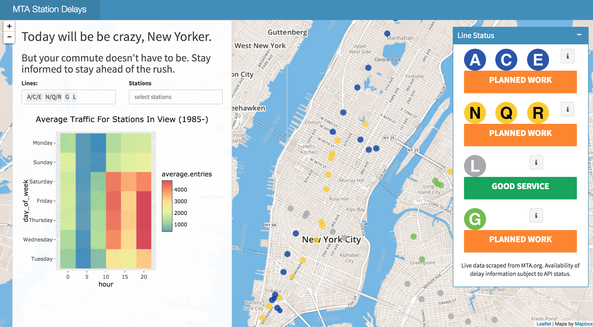

# DataDive Hackathon Submission

This is my submission for the 2017 CodeJam Hackathon! I used data on the New York City subway system (provided by the hackathon organizers) and scraped the MTA's site to build Shiny App which provides delay information and historical patterns in subway traffic. 

[The application is live here.](https://tamir.shinyapps.io/nyc-metro-delays/)

I worked on this project alone, and so there was only so much I could do in 36 hours[1]. With more time, I'd like to mine more text data (e.g from Twitter, news sites, SnapChat) in order to build a more complete real-time view of the NYC Subway system status. 
The Subway operations are unpredictable, but if we crowdsource our data effectively, perhaps we can all avoid delays together.

This competiton was a lot of fun. Thanks DataDive folk!

-Tamir

---

[1] Disclaimer: I was in a rush to implement functionality over the competition, and did not spend time worrying about my code aesthetics.
